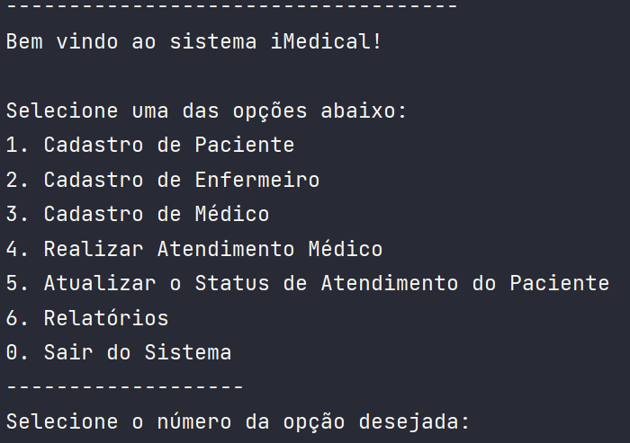
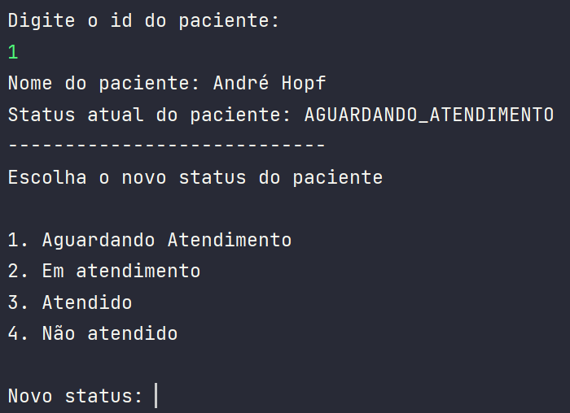
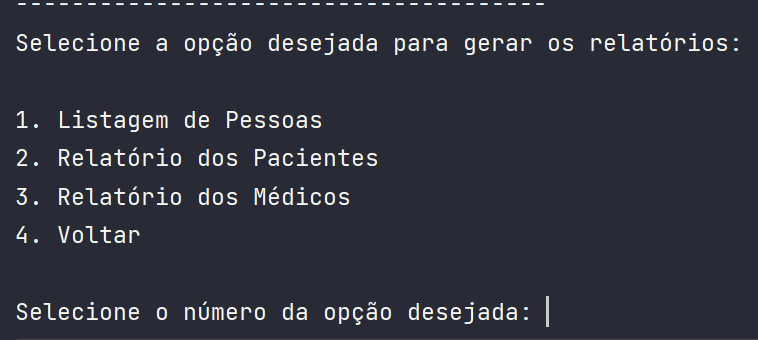
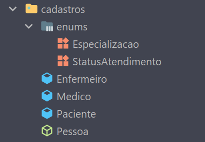
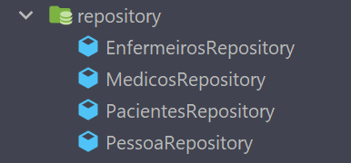
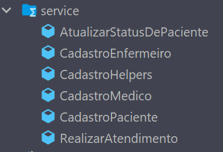
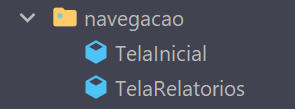
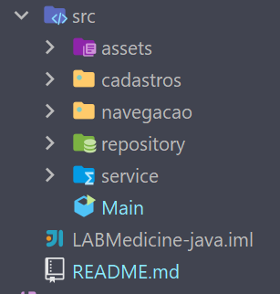

# iMedicine - Gerenciamento de cadastros de Pacientes, Médicos e Enfermeiros para sua clínica!

## Conteúdos:

- [Introdução](#introdução)
- [Executando o Sistema](#executando-o-sistema)
- [Utilizando o Sistema](#utilizando-o-sistema)
  - [Cadastro de Pacientes](#cadastro-de-paciente)
  - [Cadastro de Enfermeiro](#cadastro-de-enfermeiro)
  - [Cadastro de Médico](#cadastro-de-médico)
  - [Realizar Atendimento Médico](#realizar-atendimento-médico)
  - [Atualizar o Status de Atendimento do Paciente](#atualizar-o-status-de-atendimento-do-paciente)
  - [Relatórios](#relatórios)
- [Técnicas e tecnologias utilizadas](#técnicas-e-tecnologias-utilizadas)
  - [Estrutura e organização do projeto](#estrutura-de-organização-do-projeto-)
  - [Desenvolvimento do Projeto](#desenvolvimento-do-projeto-)
- [Melhorias Futuras](#melhorias-e-implementações-futuras)
- [Vídeo Explicativo](#link-para-vídeo-explicativo)

## Introdução

Bem vindo ao sistema iMedicine!

Através desta aplicação é possível:
* Organizar o cadastro dos pacientes, médicos e enfermeiros de sua clínica;
* Manter em vista o status dos pacientes dentro de sua clínica, facilitando o gerenciamento dos horários das consultas, melhorando a experiência dos clientes dentro da clínica;
* Procurar os médicos cadastrados de acordo com sua especialização;

Esta é a versão 1.0 do sistema. Futuramente você poderá também:

* Editar os cadastros;
* Realizar filtragens avançadas no banco de dados;
* Persistir os dados cadastrados após a finalização da aplicação;

<hr>

## Executando o sistema

Para executar este sistema você deve ter o Java instalado na sua máquina, ou abri-lo utilizando uma IDE com o JVM integrado.

Para maiores informações visite [o site oficial Java](https://www.java.com/en/).

Com um terminal aberto no local que você deseja salvar este projeto, clone este repositório utilizando o comando

````
git clone git@github.com:ajhopf/LABMedicine-java.git
````

Assim como a maior parte dos sistemas Java, a "porta de entrada" do sistema é através do método main da classe Main.

Visando facilitar a execução de testes instanciamos dois pacientes, um médico e um enfermeiro.

Se você deseja iniciar o sistema sem nenhuma pessoa cadastrada simplesmente delete esta parte do código.

O único código realmente necessário da classe Main é:

````
public static void main(String[] args) {
    TelaInicial.iniciar();
}
````

Para iniciar o sistema, execute o método main.

<hr>

## Utilizando o sistema

Ao inicializar o sistema é gerado o menu inicial com 7 opções:

<p align="center">
     
</p>

O usuário deve escolher a opção através de um número.

Caso o usuário digite um número não disponível ou letras, o sistema mostrará uma mensagem de erro, renderizando novamente o menu. Este fluxo de verificação está presente em todo o sistema, desta forma evitando que um erro de digitação "quebre" o sistema.

### Cadastro de Paciente

Ao escolher a opção '1' o usuário irá ser direcionado para a criação de um novo paciente.

O nome, gênero, data de nascimento, cpf e telefone são atributos da classe Pessoa, portanto para qualquer tipo de cadastro estes são as primeira informações a serem incluídas.

O gênero deverá ser um entre três opções:
* masculino;
* feminino;
* outro

A data de nascimento deve estar no formato dd/mm/aaaa.

O cpf deve conter 11 dígitos e estar no formado 111.222.333-44 ou 11122233344.

O telefone deve conter 8 ou 9 dígitos. O DDD é opcional e, se incluído, deve estar no formado (dd).
Os formatos válidos de telefone são: 99999999, 9999-9999, (dd) 99999999, (dd) 9999-9999.

Sempre que instanciado um novo paciente, médico ou enfermeiro é gerada uma mensagem de confirmação contendo os dados cadastrados.
O código de identificação de cada pessoa (id) é gerado automaticamente utilizando o tamanho da sua respectiva lista dentro do repositório.

Especificamente em relação ao paciente devem ser incluídas as seguinte informações:
* Contato de emergência - obrigatório;
* Convênio - o usuário deverám responde se o paciente possui ou não convênio. Ao responder que sim, deverá ser digitado o nome do convênio, o número e a data de validade.
* Lista de alergias - o usuário deverá responder se o paciente tem ou não alergias. Caso responda que sim, será aberta um novo input. As alergias devem ser incluídas uma por vez e ao concluir o usuário deverá digitar '0' para finalizar a inclusão de alergias;
* Lista de cuidados específicos - funciona da mesma maneira que a lista de alergias.
* Status de atendimento - podendo escolher entre 4 opções: aguardando atendimento, em atendimento, atendido e não atendido - obrigatório.

Ao instanciar um novo paciente o atributo 'atendimentosRealizados' inicia como '0'.

### Cadastro de Enfermeiro

Opção '2' do sistema.

Além das informações básicas de Pessoa, para o cadastro de enfermeiro devem ser incluídos:

* Local de formação - obrigatório;
* Cadastro Cofen - obrigatório;

### Cadastro de Médico

Opção '3' do sistema.

Por fim, a classe médico possui os seguinte atributos específicos:

* Local de formação - obrigatório;
* Cadastro crm - obrigatório;
* Especialização - uma entre as 8 opções disponíveis - obrigatório;
* Situação no sistema - ativo ou inativo. Os médicos inativos não poderão realizar atendimentos - obrigatório.

Ao ser instanciado um novo médico o atributo 'atendimentosRealizados' inicia como '0'.

### Realizar Atendimento Médico

Opção '4' do sistema.

Para que seja possível realizar atendimento médico é necessário que exista ao menos um médico e um paciente cadastrados no sistema.

Deve ser selecionado um médico através do seu Id. O médico deverá estar ativo dentro do sistema. Caso esteja inativo uma mensagem de erro será exibida, levando o usuário de volta a tela inicial.
Ao selecionar um médico, é exibido o seu nome.
Após, deverá ser selecionado um paciente, também através do seu Id.

Sendo concluídas estas etapas o número de atendimentos do médico e do paciente são acrescidos em um e o status de atendimento do paciente é atualizado para 'EM_ATENDIMENTO".

### Atualizar o Status de Atendimento do Paciente

Opção '5' do sistema.

Deve ser selecionado um paciente através do seu Id.
Ao selecioná-lo, é exibido o seu nome e seu status atual.

<p align="center">
    
</p>

O usuário deverá escolher o novo status do paciente.

### Relatórios

Opção '6' do sitema.

<p align="center">
    
</p>

Neste menu é possível escolher entre relatórios gerais através da listagem de pessoas ou relatórios específicos de pacientes e médicos.

Os relatórios de pacientes poderão ser filtrados de acordo com seu status no sistema. Os relatórios médicos podem ser exibidos de acordo com sua especialização.

<hr>

## Técnicas e tecnologias utilizadas

Para o desenvolvimento do software foi utilizada a linguagem Java.
Java é uma linguagem de programação orientada a objetos, onde o código é organizado dentro de Classes.

### Estrutura de organização do projeto:

Em uma aplicação Java o "ponto de entrada" do sistema é realizada através do método main. Este método está localizado na classe Main.

#### Cadastros:

<p align="center">
    
</p>

Neste package estão todas as classes para criação de novas pessoas.

A classe Pessoa é abstrata, ou seja, não podem ser criadas instâncias de Pessoa. Ela serve para organizar atributos que estarão presentes em todas suas classes filhas.

As classes Enfermeiro, Médico e Paciente estendem a classe Pessoa e contém os seus próprios métodos e atributos. Através dos construtores destas classes que criaremos novos cadastros dentro do sistema.

Além disso, o sistema possui também duas classes Enums, que são utilizados para criar estruturas fixas de dados, garantindo que o status de atendimento dos pacientes e a especialização dos médicos sejam válidos.

#### Repository:

<p align="center">
    
</p>

Neste package encontramos a listagem de todas pessoas cadastradas em nosso sistema.
Ao criar uma nova pessoa, o seu cadastro irá ser adicionado à sua respectiva lista.

Além disso, através do PessoaRepository temos acesso à lista "mestra", que centraliza todos os cadastros.

#### Service:
<p align="center">
    
</p>

Na pasta service encontramos a lógica por trás de todas as operações do sistema, sendo elas:
* Atualizar o status de um paciente, através do seu ID;
* Realizar atendimento médico, utilizando o ID do médico e do paciente;
* Cadastrar novos médicos, enfermeiros e pacientes -> dentro da pasta cadastros;
* Obter os relatórios dos cadastros -> pasta relatorios;

Além disso, a classe CadastroHelpers contém funções que são partilhadas por todas as classes de cadastro.

#### Navegação:

<p align="center">
    
</p>

Por fim, no package Navegação estão as classes responsáveis pelas telas que o usuário utilizará para navegar dentro do sistema.


#### Organização geral das pastas

<p align="center">
    
</p>

### Desenvolvimento do projeto:

Para organização do desenvolvimento do projeto foi utilizado o método Kanban e o board de cards do Trello.

A aplicação foi dividida em pontos chave, sendo criado um novo card para cada um destes.

O board foi dividido em 4 colunas:
* Backlog - onde foram posicionados todos os cards no início do projeto;
* Em andamento - ao iniciar um novo tópico, o seu respectivo card era transferido do backlog para esta coluna;
* Revisão de código - ao terminar uma etapa o seu respectivo card era posicionado nesta coluna, quando era feita uma releitura dos requisitos e regras de negócio para garantir a qualidade e eficiência do sistema;
* Concluído - após a revisão, o card é arrastado para esta coluna e uma cerveja aberta.

Para versionamento do código foi utilizado o github, sendo aberta uma nova branch para cada etapa do projeto. As branchs utilizadas foram:

* cadastros -> criação das classes das pessoas e seus respectivos métodos e atributos;
* navegacao -> implementação das opções de navegação, telas e menus;
* relatorios -> execução dos relatórios;
* code-review -> uma vez pronto, o sistema passou por uma nova rodada de revisão, otimizando a organização do código e a experiência do usuário. 

## Melhorias e implementações futuras

Este projeto ainda está em desenvolvimento.

Na fase atual contamos apenas com o produto viável mínimo (MVP), visando a entrega de valor para o cliente, levando em consideração a necessidade de uma entrega contínua, além de possibilitar que o cliente visualize o sistema e proponha alterações de acordo com suas necessidades.

Dito isto, algumas das melhorias que estão em vista para um futuro próximo:

* Edição dos cadastros;
* Implementar um novo repositório contendo informações das consultas dos pacientes;
* Realizar filtragens avançadas no banco de dados;
* Persistir os dados cadastrados após a finalização da aplicação;
* Possibilitar o agendamento de consultas para os médicos;
* Implementar um front-end para que o sistema se torne mais amigável ao usuário;
* Tradução do sistema para o inglês, visando a venda do sistema para o exterior;

## Link para vídeo explicativo

https://drive.google.com/file/d/11HbQmW5kyW9nr6iNFtim0-mOHDPvWyZy/view?usp=sharing
