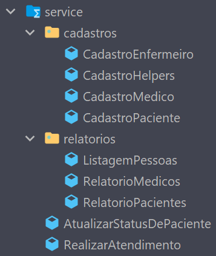

# iMedicine - Gerenciamento de cadastros de Pacientes, Médicos e Enfermeiros para sua clínica!

## Introdução

Bem vindo ao sistema iMedicine! 

Através desta aplicação é possível:
* Organizar o cadastro dos pacientes, médicos e enfermeiros de sua clínica;
* Manter em vista o status dos pacientes dentro de sua clínica, facilitando o gerenciamento dos horários das consultas, melhorando a experiência dos clientes dentro da clínica;
* Procurar os médicos cadastrados de acordo com sua especialização;

Esta é a versão 1.0 do sistema. Futuramente você poderá também:

* Editar os cadastros;
* Realizar filtragens avançadas no banco de dados;
* Persistir os dados cadastrados após a finalização da aplicação;

## Técnicas e tecnologias utilizadas

Para o desenvolvimento do software foi utilizada a linguagem Java.
Java é uma linguagem de programação orientada a objetos, onde o código é organizado dentro de Classes.

### Estrutura de organização do projeto:

Em uma aplicação Java o "ponto de entrada" do sistema é realizada através do método main. Este método está localizado na classe Main.

#### Cadastros:

    

Neste package estão todas as classes para criação de novas pessoas. 

A classe Pessoa é abstrata, ou seja, não podem ser criadas instâncias diretamente dela. Ela serve para organizar atributos que estarão presentes em todas suas classes filhas.

As classes Enfermeiro, Médico e Paciente estendem a classe Pessoa e contém os seus próprios métodos e atributos. Através dos construtores destas classes que criaremos novos cadastros dentro do sistema.

Além disso, o sistema possui também duas classes Enums, que são utilizados para criar estruturas fixas de dados, garantindo que o status de atendimento dos pacientes e a especialização dos médicos sejam válidos.

#### Repository:

    

Neste package encontramos a listagem de todas pessoas cadastradas em nosso sistema.
Ao criar uma nova pessoa, o seu cadastro irá ser adicionado à sua respectiva lista.

Além disso, através do PessoaRepository temos acesso à lista "mestra", que centraliza todos os cadastros.

#### Service:

    

Na pasta service encontramos a lógica por trás de todas as operações do sistema, sendo elas:
* Atualizar o status de um paciente, através do seu ID;
* Realizar atendimento médico, utilizando o ID do médico e do paciente;
* Cadastrar novos médicos, enfermeiros e pacientes;

Além disso, a classe CadastroHelpers contém funções que são partilhadas por todas as classes de cadastro.

#### Navegação:

    

Por fim, no package Navegação estão as classes responsáveis por os relatórios e as telas que o usuário utilizará para navegar dentro do sistema.

#### Organização geral das pastas

    

### Desenvolvimento do projeto:

Para organização do desenvolvimento do projeto foi utilizado o método Kanban e o board de cards do Trello.

A aplicação foi dividida em pontos chave, sendo criado um novo card para cada um destes.

O board foi dividido em 4 colunas:
* Backlog - onde foram posicionados todos os cards no início do projeto;
* Em andamento - ao iniciar um novo tópico, o seu respectivo card era transferido do backlog para esta coluna;
* Revisão de código - ao terminar uma etapa o seu respectivo card era posicionado nesta coluna, quando era feita uma releitura dos requisitos e regras de negócio para garantir a qualidade e eficiência do sistema;
* Concluído - após a revisão, o card é arrastado para esta coluna e uma cerveja aberta.

Para versionamento do código foi utilizado o github, sendo aberta uma nova branch para cada etapa do projeto. As branchs utilizadas foram:

* cadastros -> criação das classes das pessoas e seus respectivos métodos e atributos;
* navegacao -> implementação das opções de navegação, telas e menus;
* relatorios -> execução dos relatórios;
* code-review -> uma vez pronto, o sistema passou por uma nova rodada de revisão, otimizando a organização do código e a experiência do usuário. 
